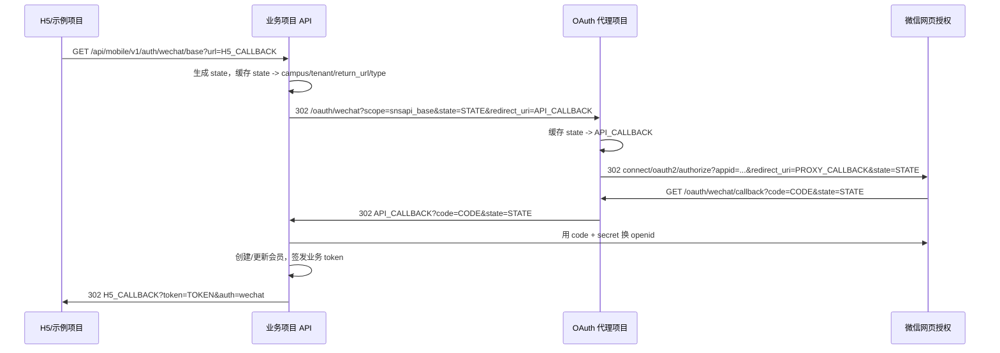
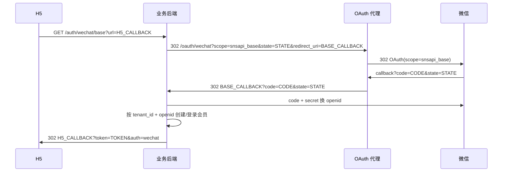
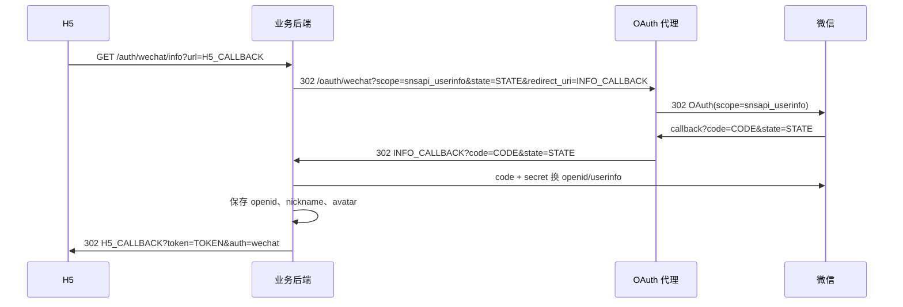

# WeChat Public Auth Proxy

一个 Laravel 版微信公众号网页授权代理。它解决的问题是：只有一个公众号网页授权域名，但有多个示例项目、测试项目或 H5 项目需要使用同一个公众号登录。

当前实现只代理微信 OAuth `code`，不在代理项目中换取 `access_token/openid`。业务项目仍负责使用 `code + app secret` 换取用户 OpenID，并完成自己的会员创建、登录 token 签发、业务绑定等逻辑。

面向 agent 的接口文档放在：

```text
/docs/api.md
```

## 目标

实现一个独立代理站点，例如：

```text
https://wx-pub-api.example.com
```

微信公众号后台只配置这个代理域名作为网页授权域名。业务项目发起登录时不再直接跳微信，而是跳到代理：

```text
https://wx-pub-api.example.com/oauth/wechat
```

代理再跳微信。微信回调代理域名后，代理把 `code/state` 原样转回业务项目自己的 callback。

## 核心原则

1. 代理项目只需要公众号 `appid`。
2. 代理项目不需要公众号 `secret`。
3. `state` 必须由业务项目生成并透传给代理。
4. 业务项目原来的 `code -> openid -> member -> token` 流程尽量保持不变。
5. 代理只解决微信网页授权域名限制，不做业务登录。

## 整体流程



## 代理项目实现

### 1. 配置文件

新增 `config/wechat_oauth.php`：

```php
<?php

return [
    'app_id' => env('WECHAT_OFFICIAL_ACCOUNT_APP_ID', env('WECHAT_APP_ID')),

    'default_scope' => env('WECHAT_OAUTH_DEFAULT_SCOPE', 'snsapi_base'),

    'allowed_scopes' => [
        'snsapi_base',
        'snsapi_userinfo',
    ],

    'allowed_redirect_hosts' => array_values(array_filter(array_map(
        'trim',
        explode(',', (string) env('WECHAT_OAUTH_ALLOWED_REDIRECT_HOSTS', ''))
    ))),

    'state_ttl_minutes' => (int) env('WECHAT_OAUTH_STATE_TTL_MINUTES', 10),
];
```

环境变量：

```env
APP_URL=https://wx-pub-api.example.com
CACHE_DRIVER=file

WECHAT_OFFICIAL_ACCOUNT_APP_ID=wx...
WECHAT_OAUTH_DEFAULT_SCOPE=snsapi_base
WECHAT_OAUTH_ALLOWED_REDIRECT_HOSTS=school.example.com,h5-dev.example.test
WECHAT_OAUTH_STATE_TTL_MINUTES=10
```

`WECHAT_OAUTH_ALLOWED_REDIRECT_HOSTS` 留空表示不限制业务项目回跳 host。支持：

- 精确 host：`school.example.com`
- 通配全部：`*`
- 子域名通配：`*.example.com`

### 2. 路由

在 `routes/web.php` 注册：

```php
use App\Http\Controllers\OAuth\WeChatOAuthController;

Route::get('/oauth/wechat', [WeChatOAuthController::class, 'redirect'])
    ->name('oauth.wechat.redirect');

Route::get('/oauth/wechat/callback', [WeChatOAuthController::class, 'callback'])
    ->name('oauth.wechat.callback');
```

这两个接口放在 `web.php` 是为了得到干净的根路径，不带 `/api` 前缀。

### 3. 发起授权接口

接口：

```text
GET /oauth/wechat?scope=snsapi_base&state=<业务项目生成的 state>&redirect_uri=<urlencoded 业务项目 callback>
```

参数：

| 参数 | 必填 | 说明 |
| --- | --- | --- |
| `redirect_uri` | 是 | 业务项目自己的微信授权 callback，例如 `https://school.example.com/api/mobile/v1/auth/wechat/base-callback?...` |
| `scope` | 否 | `snsapi_base` 或 `snsapi_userinfo`，默认 `snsapi_base` |
| `state` | 否 | 推荐业务项目必传；代理在缺失时可生成随机 state |
| `app_id` / `appid` | 否 | 只有代理项目未配置 `WECHAT_OFFICIAL_ACCOUNT_APP_ID` 时才作为兜底 |

处理步骤：

1. 读取并解码 `redirect_uri`。
2. 校验 `redirect_uri` 必须是完整 `http/https` 地址。
3. 如果配置了 `WECHAT_OAUTH_ALLOWED_REDIRECT_HOSTS`，校验 `redirect_uri` 的 host。
4. 校验 `scope` 必须是 `snsapi_base` 或 `snsapi_userinfo`。
5. 读取 `state`，没有则生成 32 位随机字符串。
6. 将 `state -> redirect_uri/scope/app_id/created_at` 写入 Cache，TTL 默认 10 分钟。
7. 构造微信 OAuth URL：

   ```text
   https://open.weixin.qq.com/connect/oauth2/authorize
     ?appid=APPID
     &redirect_uri=https://wx-pub-api.example.com/oauth/wechat/callback
     &response_type=code
     &scope=snsapi_base
     &state=STATE
   #wechat_redirect
   ```

8. 使用 `redirect()->away($wechatAuthorizeUrl)` 跳转微信。

### 4. 微信回调接口

接口：

```text
GET /oauth/wechat/callback?code=<wechat-code>&state=<state>
```

处理步骤：

1. 校验 `code/state` 必须存在。
2. 根据 `state` 从 Cache 读取原始 `redirect_uri`。
3. 如果 state 不存在，返回 `419`，提示授权状态过期。
4. 将 `code/state` 追加到原始 `redirect_uri`。
5. 跳回业务项目 callback。

追加 query 时要正确处理：

- 原 URL 没有 query：追加 `?code=...&state=...`
- 原 URL 已有 query：追加 `&code=...&state=...`
- 原 URL 是 hash route：例如 `/h5/#/pages/auth/callback`，应追加到 hash 内部：

  ```text
  /h5/#/pages/auth/callback?code=...&state=...
  ```

### 5. 域名验证文件

微信网页授权域名验证文件放在代理项目 `public/` 目录。

示例：

```text
public/MP_verify_xxxxxxxxxxxxxxxx.txt
```

Nginx 站点根目录必须指向：

```text
/path/to/wechat-public-auth/public
```

这样微信才能访问：

```text
https://wx-pub-api.example.com/MP_verify_xxxxxxxxxxxxxxxx.txt
```

## 业务项目接入方式

业务项目原本通常是：

```text
业务项目 -> 微信 -> 业务项目 callback
```

接入代理后变成：

```text
业务项目 -> 代理 -> 微信 -> 代理 callback -> 业务项目 callback
```

以下以 Laravel 业务项目为例。

### 1. 配置项

在 `config/services.php` 的微信移动端配置里增加：

```php
'wechat_mobile' => [
    'app_id' => env('WECHAT_OFFICIAL_ACCOUNT_APP_ID', env('WECHAT_APP_ID')),
    'secret' => env('WECHAT_OFFICIAL_ACCOUNT_SECRET', env('WECHAT_SECRET')),
    'callback_base_url' => env('MOBILE_WECHAT_CALLBACK_BASE_URL'),
    'oauth_proxy_url' => env('MOBILE_WECHAT_OAUTH_PROXY_URL'),
    'proxy_allow_insecure_callback' => env('MOBILE_WECHAT_PROXY_ALLOW_INSECURE_CALLBACK', false),
    'allowed_redirect_hosts' => array_values(array_filter(array_map(
        'trim',
        explode(',', (string) env('MOBILE_H5_ALLOWED_REDIRECT_HOSTS', ''))
    ))),
],
```

业务项目环境变量：

```env
WECHAT_OFFICIAL_ACCOUNT_APP_ID=wx...
WECHAT_OFFICIAL_ACCOUNT_SECRET=...

MOBILE_WECHAT_CALLBACK_BASE_URL=https://school.example.com
MOBILE_WECHAT_OAUTH_PROXY_URL=https://wx-pub-api.example.com/oauth/wechat
MOBILE_WECHAT_PROXY_ALLOW_INSECURE_CALLBACK=false
MOBILE_H5_ALLOWED_REDIRECT_HOSTS=school.example.com
```

本地或内网示例项目调试时，如果最终用户手机能访问内网地址，可以显式放宽：

```env
MOBILE_WECHAT_CALLBACK_BASE_URL=http://api-dev.example.test:10001
MOBILE_WECHAT_PROXY_ALLOW_INSECURE_CALLBACK=true
MOBILE_H5_ALLOWED_REDIRECT_HOSTS=h5-dev.example.test,localhost,127.0.0.1
```

### 2. 发起授权逻辑

业务项目的授权入口负责生成 `state`，并缓存业务上下文。

伪代码：

```php
private function redirectToWechatOauth(Request $request, string $type): RedirectResponse
{
    $validated = $request->validate([
        'url' => ['required', 'string', 'max:1000'],
    ]);

    $redirectUrl = $this->safeH5RedirectUrl($request, $validated['url']);
    $state = Str::random(32);
    $campusCode = $this->campusCode($request);

    Cache::put('mobile_wechat_oauth:'.$state, [
        'campus_code' => $campusCode,
        'tenant_id' => $this->tenantId(),
        'redirect_url' => $redirectUrl,
        'type' => $type,
    ], now()->addMinutes(10));

    $callbackUrl = $this->wechatCallbackUrl($request, $type, $campusCode, $redirectUrl);
    $redirectTo = $this->wechatAuthorizeRedirectUrl($type, $state, $callbackUrl);

    return redirect()->away($redirectTo);
}
```

### 3. 决定跳代理还是直连微信

新增一个方法：

```php
private function wechatAuthorizeRedirectUrl(string $type, string $state, string $callbackUrl): string
{
    $proxyUrl = trim((string) config('services.wechat_mobile.oauth_proxy_url'));

    if ($proxyUrl !== '') {
        return $this->appendQuery($proxyUrl, [
            'scope' => $type === 'info' ? 'snsapi_userinfo' : 'snsapi_base',
            'state' => $state,
            'redirect_uri' => $callbackUrl,
        ]);
    }

    return $this->wechatProvider($type, $callbackUrl)
        ->withState($state)
        ->redirect();
}
```

这样可以做到：

- 配置了 `MOBILE_WECHAT_OAUTH_PROXY_URL`：跳代理。
- 没配置：保留原来的直连微信逻辑。

### 4. callback base URL 校验

业务项目直连微信时，`MOBILE_WECHAT_CALLBACK_BASE_URL` 必须是线上 HTTPS，因为微信会直接访问业务项目 callback。

代理模式下，微信只访问代理域名；业务项目 callback 是用户浏览器后续访问的地址。因此可以通过配置允许内网 HTTP callback：

```php
private function wechatCallbackUrl(Request $request, string $type, string $campusCode, ?string $returnUrl = null): string
{
    $baseUrl = rtrim(trim((string) config('services.wechat_mobile.callback_base_url')), '/');
    $parts = parse_url($baseUrl);

    $scheme = strtolower((string) ($parts['scheme'] ?? ''));
    $host = trim((string) ($parts['host'] ?? ''));

    if ($baseUrl === '' || ! is_array($parts) || $host === '') {
        throw ValidationException::withMessages([
            'wechat' => ['MOBILE_WECHAT_CALLBACK_BASE_URL 必须配置为线上 HTTPS 地址'],
        ]);
    }

    if ($scheme !== 'https' && ! $this->allowsInsecureWechatCallbackInProxyMode()) {
        throw ValidationException::withMessages([
            'wechat' => ['MOBILE_WECHAT_CALLBACK_BASE_URL 必须配置为线上 HTTPS 地址'],
        ]);
    }

    $query = ['campus_code' => $campusCode];
    if ($returnUrl !== null && $returnUrl !== '') {
        $query['return_url'] = $this->safeH5RedirectUrl($request, $returnUrl);
    }

    return $baseUrl.'/api/mobile/v1/auth/wechat/'.$type.'-callback?'.http_build_query($query, '', '&', PHP_QUERY_RFC3986);
}

private function allowsInsecureWechatCallbackInProxyMode(): bool
{
    return trim((string) config('services.wechat_mobile.oauth_proxy_url')) !== ''
        && (bool) config('services.wechat_mobile.proxy_allow_insecure_callback');
}
```

### 5. 业务 callback 逻辑保持不变

业务 callback 仍然接收：

```text
code
state
```

然后：

1. 用 `state` 读取业务项目缓存。
2. 用 `code` 调微信接口换 openid。
3. 按 `tenant_id + openid` 创建或更新会员。
4. 签发业务系统 token。
5. 跳回 H5 callback，附带 `token`。

代理不参与这一步。

## 获取 openid 与头像昵称流程

`openid`、头像、昵称都应该由业务后端获取，不建议放到代理项目中获取。原因是换取这些信息需要公众号 `secret`，而 `openid` 最终也是业务项目用来识别会员、绑定支付和签发登录 token 的后端数据。

代理项目只负责把微信返回的 `code` 交还给业务项目。业务项目拿到 `code` 后，根据本次授权类型决定能拿到哪些信息：

| 授权类型 | 微信 scope | 用户感知 | 后端可得到的信息 | 推荐场景 |
| --- | --- | --- | --- | --- |
| 静默授权 | `snsapi_base` | 通常不弹确认页 | `openid` | 默认登录、支付前识别用户 |
| 资料授权 | `snsapi_userinfo` | 会要求用户确认 | `openid`、昵称、头像等 | 个人资料页同步微信资料 |

### 静默登录：只拿 openid



静默授权不要求头像昵称一定存在。业务项目可以给新会员生成默认昵称，例如 `微信用户1234`。

### 资料授权：拿 openid、头像、昵称



注意：

1. `openid` 默认只保存在业务后端，不放到 H5 回调 URL。
2. H5 只需要拿业务 `token`，再通过 `/bootstrap` 或 `/me` 读取昵称头像。
3. 代理 callback 仍然只转发 `code/state`，不返回 `openid/nickname/avatar`。
4. H5 默认未登录流程建议走 `base`；个人资料页“同步微信资料”按钮再走 `info`。

## 测试用例

代理项目建议至少覆盖：

1. `/oauth/wechat` 能跳转到微信 OAuth。
2. 跳微信 URL 中包含正确 `appid/scope/state/redirect_uri`。
3. 发起授权时会缓存 `state -> redirect_uri`。
4. 缺少 `state` 时代理能生成 state。
5. `scope=snsapi_userinfo` 会被原样透传到微信 OAuth。
6. `/oauth/wechat/callback` 只把 `code/state` 转回原始 `redirect_uri`，不夹带 `openid/nickname/avatar`。
7. 原始 `redirect_uri` 已有 query 时能正确追加参数。
8. hash route URL 能正确把 query 追加到 hash 内部。
9. 不允许的 redirect host 返回 422。
10. 不支持的 scope 返回 422。
11. 过期或未知 state 返回 419。

业务项目建议至少覆盖：

1. 未配置代理时，仍然直连微信。
2. 配置代理时，授权入口跳到代理 URL。
3. 跳代理时透传 `scope/state/redirect_uri`。
4. 业务项目自己的 `state` 缓存仍存在。
5. 代理模式下可通过配置允许内网 HTTP callback。
6. `base` 授权使用 `snsapi_base`，callback 收到 `code/state` 后能创建会员并返回 token。
7. `info` 授权使用 `snsapi_userinfo`，callback 能保存 `openid/nickname/avatar` 并返回 token。
8. H5 回调 URL 不暴露 `openid`，登录后通过 `/bootstrap` 或 `/me` 获取昵称头像。

## 部署要点

代理项目：

```bash
composer install --no-dev --optimize-autoloader
cp .env.example .env
php artisan key:generate
php artisan config:clear
```

Nginx root 指向：

```text
/var/www/wechat-public-auth/public
```

生产环境变量示例：

```env
APP_ENV=production
APP_DEBUG=false
APP_URL=https://wx-pub-api.example.com
CACHE_DRIVER=file

WECHAT_OFFICIAL_ACCOUNT_APP_ID=wx...
WECHAT_OAUTH_DEFAULT_SCOPE=snsapi_base
WECHAT_OAUTH_ALLOWED_REDIRECT_HOSTS=
WECHAT_OAUTH_STATE_TTL_MINUTES=10
```

部署后验证：

```bash
curl -i https://wx-pub-api.example.com/MP_verify_xxxxxxxxxxxxxxxx.txt

curl -i "https://wx-pub-api.example.com/oauth/wechat?redirect_uri=https%3A%2F%2Fschool.example.com%2Fapi%2Fmobile%2Fv1%2Fauth%2Fwechat%2Fbase-callback%3Fcampus_code%3Ddemo-campus&state=test-state"
```

预期：

- 校验文件返回 `200` 和正确文本。
- `/oauth/wechat` 返回 `302` 到 `https://open.weixin.qq.com/connect/oauth2/authorize?...`。
- 微信 OAuth URL 中的 `redirect_uri` 是代理 callback。

## 线上验收示例

部署后按实际域名验证链路即可，文档中只保留占位域名：

```text
代理域名：https://wx-pub-api.example.com
业务域名：https://school.example.com
```

建议验证：

- 代理域名下的 `MP_verify_xxxxxxxxxxxxxxxx.txt` 返回 `200`。
- 业务项目授权入口会 `302` 到代理。
- 代理会 `302` 到微信。
- 代理 callback 收到测试 `code/state` 后会 `302` 回业务项目 callback。

## 可直接复制的实现提示词

下面这段可以直接作为给代码助手的提示词，用来在一个 Laravel 项目里一次性实现同类功能。

```text
请在当前 Laravel 项目中实现一个微信公众号网页授权 code 代理，目标是让多个业务/示例项目共用一个公众号网页授权域名。

核心要求：
1. 只代理 OAuth code，不在代理项目中换 access_token/openid。
2. 代理项目只配置公众号 appid，不配置也不使用 app secret。
3. 业务项目生成 state，并把 state 原样传给代理；代理不能替换业务项目 state。
4. 代理将 state -> redirect_uri/scope/app_id 缓存 10 分钟。
5. 微信回调代理后，代理按 state 找回原始 redirect_uri，并把 code/state 追加后跳回业务项目。
6. 支持 snsapi_base 和 snsapi_userinfo 两种 scope：base 只拿 openid，info 拿 openid、昵称、头像；这些信息都由业务项目后端用 code + secret 获取。
7. openid 默认只保存在业务后端，不放到 H5 回调 URL。

请实现：
1. 新增 config/wechat_oauth.php：
   - app_id: env('WECHAT_OFFICIAL_ACCOUNT_APP_ID', env('WECHAT_APP_ID'))
   - default_scope: env('WECHAT_OAUTH_DEFAULT_SCOPE', 'snsapi_base')
   - allowed_scopes: ['snsapi_base', 'snsapi_userinfo']
   - allowed_redirect_hosts: 从 WECHAT_OAUTH_ALLOWED_REDIRECT_HOSTS 逗号分隔读取，留空表示不限制
   - state_ttl_minutes: env('WECHAT_OAUTH_STATE_TTL_MINUTES', 10)

2. 新增 App\Http\Controllers\OAuth\WeChatOAuthController：
   - GET /oauth/wechat 对应 redirect 方法
   - GET /oauth/wechat/callback 对应 callback 方法
   - redirect 方法读取 redirect_uri/scope/state/app_id
   - redirect_uri 必须是完整 http/https 地址
   - 如果 allowed_redirect_hosts 非空，则校验 redirect_uri 的 host；支持精确 host、*、*.example.com
   - scope 只允许 snsapi_base/snsapi_userinfo
   - state 缺失时生成 Str::random(32)
   - state 存 Cache，key 前缀 wechat_oauth_proxy:states:
   - 构造微信授权 URL:
     https://open.weixin.qq.com/connect/oauth2/authorize?appid=...&redirect_uri=route('oauth.wechat.callback')&response_type=code&scope=...&state=...#wechat_redirect
   - 使用 redirect()->away 跳转微信
   - callback 方法校验 code/state，根据 state 从 Cache 取 redirect_uri
   - state 不存在返回 419
   - 把 code/state 追加到 redirect_uri 后 redirect()->away 回业务项目
   - 追加 query 时正确处理原 URL 已有 query 和 hash route

3. 在 routes/web.php 注册：
   - Route::get('/oauth/wechat', [WeChatOAuthController::class, 'redirect'])->name('oauth.wechat.redirect')
   - Route::get('/oauth/wechat/callback', [WeChatOAuthController::class, 'callback'])->name('oauth.wechat.callback')

4. 更新 .env.example，加入：
   - WECHAT_OFFICIAL_ACCOUNT_APP_ID=
   - WECHAT_OAUTH_DEFAULT_SCOPE=snsapi_base
   - WECHAT_OAUTH_ALLOWED_REDIRECT_HOSTS=
   - WECHAT_OAUTH_STATE_TTL_MINUTES=10

5. 把微信 MP_verify_xxx.txt 校验文件放到 public/ 下。Nginx root 必须指向 Laravel public 目录。

6. 添加 Feature tests：
   - /oauth/wechat 会 302 到微信 OAuth
   - 微信 OAuth URL 包含正确 appid/scope/state/redirect_uri
   - 发起授权会缓存 state payload
   - state 缺失时会生成 32 位 state
   - scope=snsapi_userinfo 会被原样透传到微信 OAuth
   - /oauth/wechat/callback 会把 code/state 转回原 redirect_uri
   - callback 不返回 openid/nickname/avatar，只转发 code/state
   - redirect_uri 已有 query 时追加 &
   - hash route 时追加到 hash 内部
   - 不允许 host 返回 422
   - 不支持 scope 返回 422
   - 未知 state 返回 419

如果还需要接入一个现有 Laravel 业务项目，请在业务项目中这样改：
1. config/services.php 的 wechat_mobile 增加：
   - oauth_proxy_url: env('MOBILE_WECHAT_OAUTH_PROXY_URL')
   - proxy_allow_insecure_callback: env('MOBILE_WECHAT_PROXY_ALLOW_INSECURE_CALLBACK', false)
2. 业务项目提供两类授权入口：
   - /auth/wechat/base 使用 snsapi_base，静默获取 openid
   - /auth/wechat/info 使用 snsapi_userinfo，获取 openid、nickname、avatar
3. 业务项目发起微信授权时，先生成 state 并缓存业务上下文。
4. 根据授权类型生成业务项目自己的 callbackUrl：
   - base -> /auth/wechat/base-callback
   - info -> /auth/wechat/info-callback
5. 如果 MOBILE_WECHAT_OAUTH_PROXY_URL 非空，则跳到代理：
   proxyUrl?scope=<snsapi_base|snsapi_userinfo>&state=<业务 state>&redirect_uri=<业务 callbackUrl>
6. 如果代理 URL 为空，保持原直连微信逻辑，并按授权类型设置 WeChat provider scope。
7. callback URL 校验默认要求 HTTPS；只有配置了代理 URL 且 MOBILE_WECHAT_PROXY_ALLOW_INSECURE_CALLBACK=true 时允许 HTTP callback。
8. base callback 用 code + secret 换 openid，按 tenant_id + openid 创建/登录会员，签发业务 token。
9. info callback 用 code + secret 换 openid/userinfo，保存 nickname/avatar，签发业务 token。
10. H5 回调 URL 只附带 token/auth，不附带 openid；H5 登录后通过 /bootstrap 或 /me 读取昵称头像。
11. 添加业务项目测试：
    - /auth/wechat/info 配置代理时跳到代理
    - 代理 URL 中 scope=snsapi_userinfo，redirect_uri 指向 info-callback
    - mock 微信用户后，info-callback 保存 openid/nickname/avatar
    - 回跳 URL 不包含 openid/nickname/avatar

完成后运行测试，并输出部署所需环境变量、路由和验证 curl 命令。
```

## 常见问题

### 代理项目为什么不保存 secret？

代理只负责获取微信返回的临时 `code`，不换取用户信息。换取 `openid` 需要 `secret`，这一步仍在业务项目中完成。

### 为什么 state 要由业务项目生成？

业务项目需要用 `state` 找回登录前上下文，例如校区、租户、H5 回跳页、授权类型等。代理如果替换 state，业务项目 callback 就无法恢复上下文。

### 为什么代理 callback 要用 HTTPS？

微信网页授权回调会访问代理 callback。生产环境中代理域名应配置 HTTPS，并且 `APP_URL` 应设置为代理 HTTPS 域名，确保生成的微信 `redirect_uri` 是 HTTPS。

### 为什么用 IP 访问可能 404？

Nginx 通常按 `server_name` 匹配站点。必须用实际绑定的代理域名访问，例如：

```text
https://wx-pub-api.example.com
```

而不是直接访问服务器 IP。
